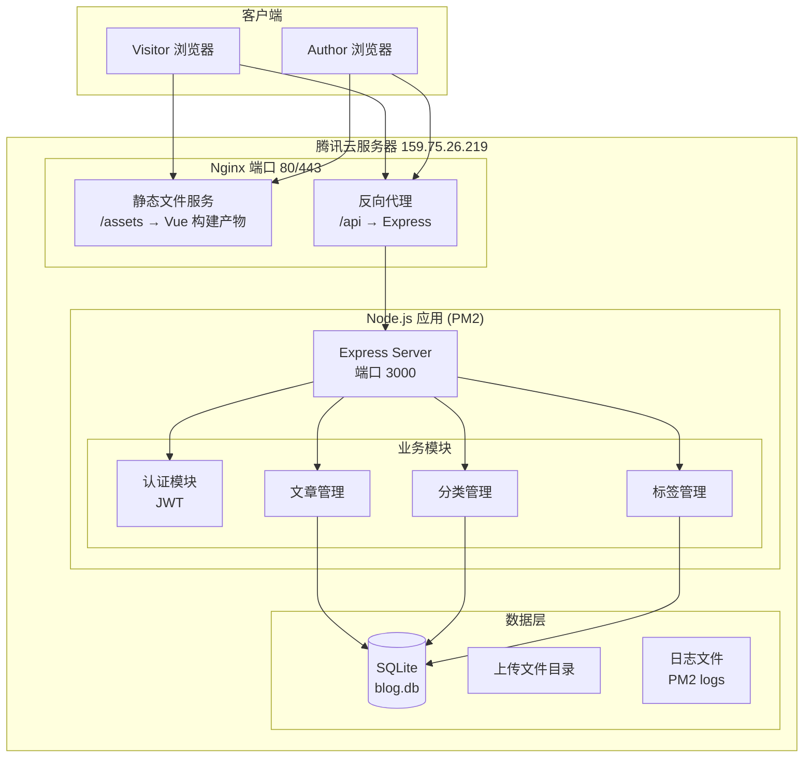
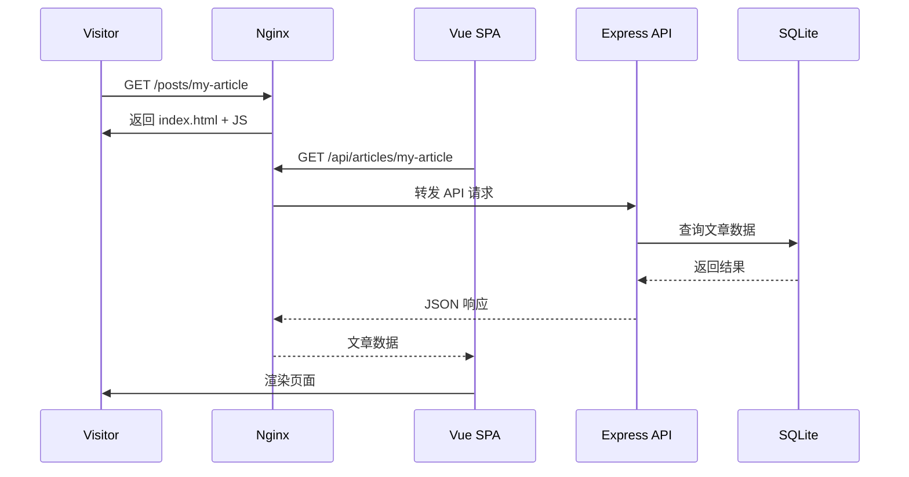
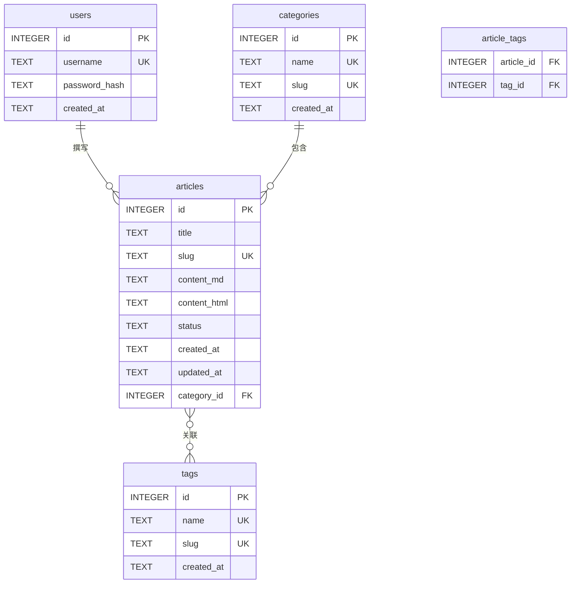

# 技术设计文档：个人博客系统

## 概述（Overview）

本设计文档描述在腾讯云 Ubuntu 服务器（IP: 159.75.26.219）上搭建个人博客系统的技术方案。系统采用前后端分离架构，前端使用 Vue 3 构建 SPA 应用，后端使用 Node.js + Express 提供 RESTful API，数据库使用 SQLite。通过 Nginx 反向代理对外提供服务，PM2 管理 Node.js 进程。

为满足 SEO 需求（需求 7），前端构建产物将通过 Nginx 直接提供静态文件服务，同时后端 API 提供文章数据的预渲染 HTML 内容，配合 `vue-meta`（或 `@unhead/vue`）动态设置页面 meta 信息。

### 技术选型

| 组件 | 选型 | 理由 |
|------|------|------|
| 前端框架 | Vue 3 + Vite | 用户偏好，Composition API 开发体验好，Vite 构建速度快 |
| 前端路由 | Vue Router 4 | Vue 3 官方路由方案 |
| 状态管理 | Pinia | Vue 3 推荐的状态管理库，轻量直观 |
| UI 框架 | Element Plus | Vue 3 生态成熟的 UI 组件库，管理后台开箱即用 |
| HTTP 客户端 | Axios | 主流 HTTP 库，支持拦截器 |
| Markdown 渲染 | marked + highlight.js | 前端渲染 Markdown，支持代码高亮 |
| 后端框架 | Express | Node.js 最成熟的 Web 框架，生态丰富 |
| 数据库 | SQLite (better-sqlite3) | 零配置、单文件，个人博客无需复杂数据库 |
| ORM | Knex.js | 轻量 SQL 查询构建器，支持迁移 |
| 认证 | JWT (jsonwebtoken) | 无状态认证，适合前后端分离架构 |
| 密码加密 | bcryptjs | 安全的密码哈希算法 |
| 进程管理 | PM2 | Node.js 生产级进程管理，支持开机自启 |
| 反向代理 | Nginx | 需求明确要求，高性能静态文件服务 |


## 架构（Architecture）

### 系统架构图



### 项目目录结构

```
personal-blog/
├── client/                    # Vue 3 前端
│   ├── src/
│   │   ├── views/             # 页面组件
│   │   │   ├── Home.vue       # 首页（文章列表）
│   │   │   ├── Post.vue       # 文章详情
│   │   │   ├── Category.vue   # 分类文章列表
│   │   │   ├── Tag.vue        # 标签文章列表
│   │   │   ├── About.vue      # 关于页面
│   │   │   └── admin/         # 管理后台页面
│   │   │       ├── Login.vue
│   │   │       ├── Dashboard.vue
│   │   │       ├── PostEditor.vue
│   │   │       ├── PostList.vue
│   │   │       ├── Categories.vue
│   │   │       └── Tags.vue
│   │   ├── components/        # 通用组件
│   │   │   ├── Pagination.vue
│   │   │   ├── TagCloud.vue
│   │   │   └── MarkdownRenderer.vue
│   │   ├── router/index.js    # 路由配置
│   │   ├── stores/            # Pinia 状态管理
│   │   ├── api/               # API 请求封装
│   │   ├── App.vue
│   │   └── main.js
│   ├── index.html
│   ├── vite.config.js
│   └── package.json
├── server/                    # Express 后端
│   ├── src/
│   │   ├── routes/            # 路由定义
│   │   │   ├── auth.js
│   │   │   ├── articles.js
│   │   │   ├── categories.js
│   │   │   ├── tags.js
│   │   │   └── sitemap.js
│   │   ├── middleware/        # 中间件
│   │   │   └── auth.js        # JWT 验证中间件
│   │   ├── models/            # 数据访问层
│   │   │   ├── db.js          # 数据库连接
│   │   │   ├── article.js
│   │   │   ├── category.js
│   │   │   ├── tag.js
│   │   │   └── user.js
│   │   ├── services/          # 业务逻辑层
│   │   │   ├── articleService.js
│   │   │   ├── categoryService.js
│   │   │   ├── tagService.js
│   │   │   └── authService.js
│   │   ├── utils/             # 工具函数
│   │   │   └── slug.js        # Slug 生成
│   │   └── app.js             # Express 应用入口
│   ├── knexfile.js            # Knex 配置
│   ├── migrations/            # 数据库迁移文件
│   └── package.json
├── ecosystem.config.js        # PM2 配置
└── nginx.conf                 # Nginx 配置示例
```

### 请求流程




## 组件与接口（Components and Interfaces）

### 1. 后端 API 接口

#### 认证接口

| 路由 | 方法 | 描述 | 认证 |
|------|------|------|------|
| `/api/auth/login` | POST | 登录，返回 JWT token | 否 |
| `/api/auth/profile` | GET | 获取当前用户信息 | 是 |

**登录请求/响应：**

```json
// POST /api/auth/login
// Request
{ "username": "admin", "password": "***" }

// Response 200
{ "token": "eyJhbG...", "expiresIn": 86400 }

// Response 401
{ "error": "用户名或密码错误" }
```

#### 文章接口

| 路由 | 方法 | 描述 | 认证 |
|------|------|------|------|
| `/api/articles` | GET | 获取已发布文章列表（分页） | 否 |
| `/api/articles/:slug` | GET | 获取文章详情 | 否 |
| `/api/admin/articles` | GET | 获取所有文章列表（含草稿） | 是 |
| `/api/admin/articles` | POST | 创建文章 | 是 |
| `/api/admin/articles/:id` | PUT | 更新文章 | 是 |
| `/api/admin/articles/:id` | DELETE | 删除文章 | 是 |

**创建文章请求：**

```json
// POST /api/admin/articles
{
  "title": "文章标题",
  "content": "Markdown 内容...",
  "categoryId": 1,
  "tagIds": [1, 2, 3],
  "status": "published"
}

// Response 201
{
  "id": 1,
  "title": "文章标题",
  "slug": "wen-zhang-biao-ti",
  "status": "published",
  "createdAt": "2025-01-01T00:00:00Z"
}
```

#### 分类接口

| 路由 | 方法 | 描述 | 认证 |
|------|------|------|------|
| `/api/categories` | GET | 获取所有分类 | 否 |
| `/api/categories/:slug` | GET | 获取分类下的文章 | 否 |
| `/api/admin/categories` | POST | 创建分类 | 是 |
| `/api/admin/categories/:id` | DELETE | 删除分类 | 是 |

#### 标签接口

| 路由 | 方法 | 描述 | 认证 |
|------|------|------|------|
| `/api/tags` | GET | 获取所有标签（含文章数） | 否 |
| `/api/tags/:slug` | GET | 获取标签下的文章 | 否 |
| `/api/admin/tags` | POST | 创建标签 | 是 |
| `/api/admin/tags/:id` | DELETE | 删除标签 | 是 |

#### SEO 接口

| 路由 | 方法 | 描述 | 认证 |
|------|------|------|------|
| `/sitemap.xml` | GET | 站点地图 | 否 |

### 2. 前端组件设计

#### 公共展示页面

- **Home.vue**：首页，调用 `GET /api/articles?page=1` 展示文章列表，包含分页组件
- **Post.vue**：文章详情页，根据 slug 调用 API 获取文章，使用 `marked` 渲染 Markdown，通过 `@unhead/vue` 设置 title/meta/OG 标签
- **Category.vue**：分类文章列表页，展示指定分类下的已发布文章
- **Tag.vue**：标签文章列表页，展示指定标签下的已发布文章
- **About.vue**：关于页面，展示博主信息（内容可配置化或硬编码）

#### 管理后台页面

- **Login.vue**：登录表单，提交凭据获取 JWT，存储到 localStorage
- **Dashboard.vue**：管理面板首页，展示文章/分类/标签统计
- **PostEditor.vue**：文章编辑器，集成 Markdown 编辑（可使用 `md-editor-v3`），支持实时预览，表单包含标题、分类选择、标签多选、状态切换
- **PostList.vue**：文章列表管理，支持查看状态、编辑、删除操作
- **Categories.vue**：分类 CRUD 管理
- **Tags.vue**：标签 CRUD 管理

#### 通用组件

- **Pagination.vue**：分页组件，接收 `total`、`currentPage`、`pageSize` props
- **TagCloud.vue**：标签云组件，根据文章数量调整标签字体大小
- **MarkdownRenderer.vue**：Markdown 渲染组件，封装 `marked` + `highlight.js`

### 3. 后端服务层接口

```javascript
// articleService.js
createArticle({ title, content, categoryId, tagIds, status }) → Article
updateArticle(id, { title, content, categoryId, tagIds, status }) → Article
deleteArticle(id) → void
getArticleBySlug(slug) → Article | null
listPublishedArticles(page, pageSize) → { articles, total }
listAllArticles(page, pageSize) → { articles, total }
listByCategory(categorySlug, page, pageSize) → { articles, total }
listByTag(tagSlug, page, pageSize) → { articles, total }
generateSlug(title) → string

// categoryService.js
createCategory(name) → Category
deleteCategory(id) → void
listCategories() → Category[]
getCategoryBySlug(slug) → Category | null

// tagService.js
createTag(name) → Tag
deleteTag(id) → void
listTags() → Tag[]  // 含文章计数
getTagBySlug(slug) → Tag | null

// authService.js
login(username, password) → { token, expiresIn }
verifyToken(token) → { userId, username }
hashPassword(password) → string
```


## 数据模型（Data Models）

### ER 关系图



### 数据库迁移（Knex.js）

#### users 表

| 字段 | 类型 | 约束 | 描述 |
|------|------|------|------|
| id | INTEGER | PK, 自增 | 用户 ID |
| username | TEXT | 唯一, 非空 | 用户名 |
| password_hash | TEXT | 非空 | bcrypt 加密后的密码 |
| created_at | TEXT | 默认 `datetime('now')` | 创建时间 |

#### articles 表

| 字段 | 类型 | 约束 | 描述 |
|------|------|------|------|
| id | INTEGER | PK, 自增 | 文章 ID |
| title | TEXT | 非空 | 文章标题 |
| slug | TEXT | 唯一, 非空 | URL 友好标识符 |
| content_md | TEXT | 非空 | Markdown 原始内容 |
| content_html | TEXT | 非空 | 渲染后的 HTML |
| status | TEXT | 默认 `'draft'`，CHECK(`status` IN ('draft','published')) | 文章状态 |
| created_at | TEXT | 默认 `datetime('now')` | 创建时间 |
| updated_at | TEXT | 默认 `datetime('now')` | 修改时间 |
| category_id | INTEGER | FK → categories.id, 可空 | 所属分类 |

#### categories 表

| 字段 | 类型 | 约束 | 描述 |
|------|------|------|------|
| id | INTEGER | PK, 自增 | 分类 ID |
| name | TEXT | 唯一, 非空 | 分类名称 |
| slug | TEXT | 唯一, 非空 | URL 友好标识符 |
| created_at | TEXT | 默认 `datetime('now')` | 创建时间 |

#### tags 表

| 字段 | 类型 | 约束 | 描述 |
|------|------|------|------|
| id | INTEGER | PK, 自增 | 标签 ID |
| name | TEXT | 唯一, 非空 | 标签名称 |
| slug | TEXT | 唯一, 非空 | URL 友好标识符 |
| created_at | TEXT | 默认 `datetime('now')` | 创建时间 |

#### article_tags 表

| 字段 | 类型 | 约束 | 描述 |
|------|------|------|------|
| article_id | INTEGER | FK → articles.id, PK | 文章 ID |
| tag_id | INTEGER | FK → tags.id, PK | 标签 ID |

### Slug 生成策略

- 使用 `pinyin` npm 包将中文转为拼音
- 英文直接转小写，空格替换为连字符 `-`，去除特殊字符
- 冲突处理：若 slug 已存在，追加数字后缀（如 `my-post-2`）

### JWT Token 设计

- 签发时包含 `{ userId, username }`
- 过期时间：24 小时
- 存储位置：前端 localStorage
- 请求时通过 `Authorization: Bearer <token>` 头传递

